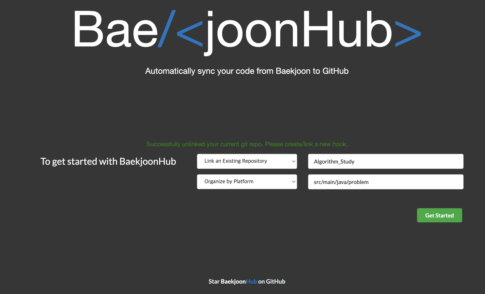
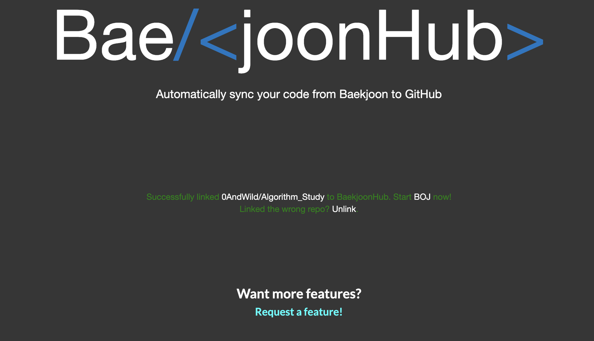
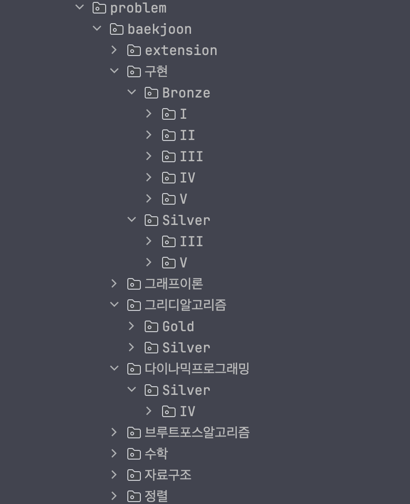
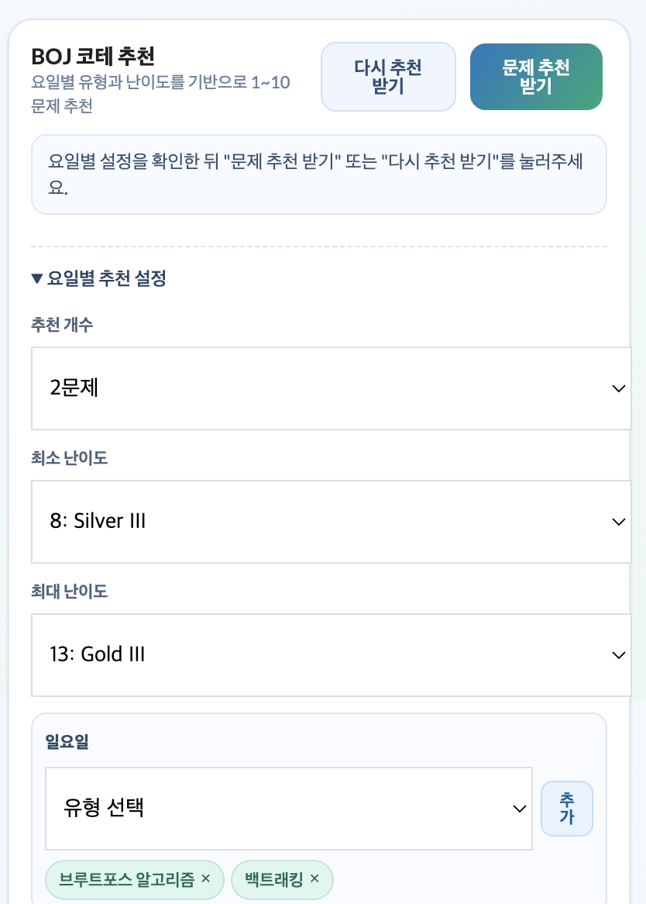
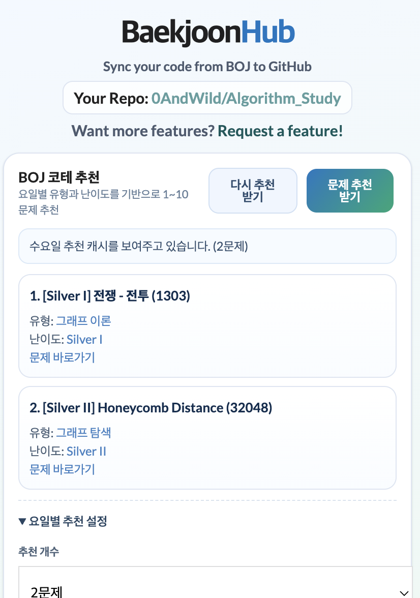
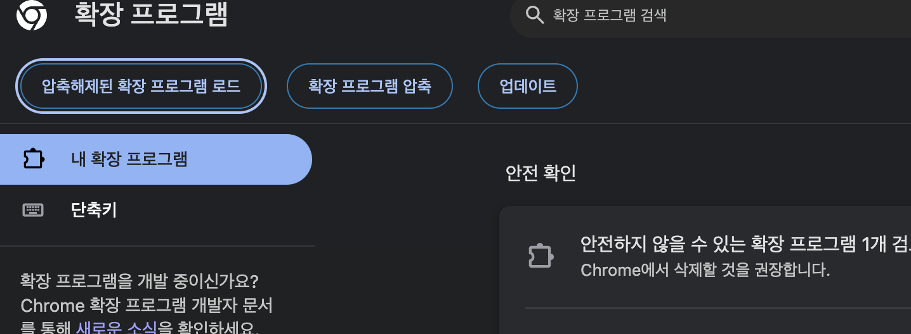
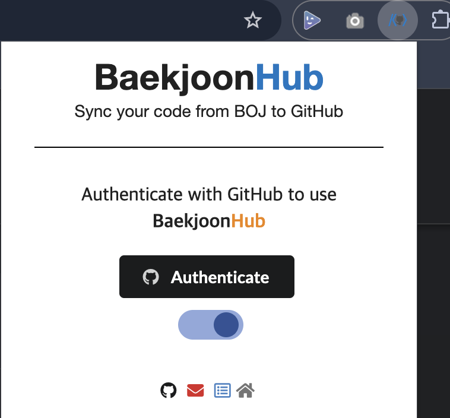

## Custom Patch Notes (Local)

이 저장소는 기본 BaekjoonHub에 있었으면 하는 기능들을 추가한 커스텀 버전입니다. 이 저장소를 가져다가 추가적인 커스텀을 하셔도 좋고, 좋은 아이디어나 추가 기능에 대한 의견이 있다면 Issue 에 남겨주시면 감사하겠습니다. =) 

`해당 커스텀 버전은 baekjoonHub 1.2.8 버전을 기준으로 만들어졌습니다.`

원본 저장소: https://github.com/BaekjoonHub/BaekjoonHub
커스텀 저장소: https://github.com/0AndWild/baekjoonhub_custom

## Version Highlights

| Version | 주요 업데이트 | 포함 항목(요약) |
|---|---|---|
| `1.0.0` | 커스텀 업로드 구조/자동화 정비 | Base Directory 지정, 백준 분류+세부 티어 경로 세분화, 문제 디렉토리명 정규화, Java `Main.java` 고정 + `package` 자동 삽입, 백준 맞은 문제 전체 일괄 업로드 |
| `1.1.1` | 코테용 요일별 문제 추천 기능 추가 | 팝업 추천 패널, 요일별 유형(태그) 설정, 난이도 범위 + 추천 개수(`1~10`) 설정, 업로드 문제 제외 추천, 추천 결과 캐시 + `다시 추천 받기`, 추천 설정 원격 저장/불러오기(`baekjoon/extension/setting.json`), 유형 추천조합 초기화 버튼 |
| `1.2.0` | 팝업 내 GitHub/Repo 관리 통합 + 추천 필터 정합성 개선 | 인증 후 `welcome.html` 이동 없이 팝업에서 repo 생성/연결/해제, GitHub 연결 해제(다른 계정 재인증), 내 repository 목록 선택, repo 트리 기반 BaseDir 선택(하위 디렉토리 탐색), 연결 repo/dir 표시, 자동 업로드 토글 상단 배치, BOJ problemset 기준 유형 목록 동기화, `외국어 문제 제외` 토글 |

## Today Local Commits (2026-03-06)

| Commit | 메시지 | README 반영 내용 |
|---|---|---|
| `896f84f` | `feat: add repo finder` | 팝업에서 내 GitHub repository 목록 선택 + repo 트리 기반 BaseDir 선택 흐름 추가 |
| `25f00c2` | `refactor: refactor linking repo` | repo 연결/해제 및 GitHub 연결 해제를 팝업 단일 흐름으로 통합, welcome 의존도 제거 |
| `e3fd2e7` | `fix: fix filter missmatching` | BOJ 문제 추천 유형 필터 정합성 개선(필터 목록/매칭 안정화) |
| `5278ae6` | `cleanup` | 팝업 UI 정리(상단 상태/버튼 배치, 섹션 정돈) |

  

### 1) 업로드 Base Directory 지정

  

  

- 배경: 기본 동작은 커밋 폴더가 항상 레포지토리 루트에 생성됨
- 변경: 사용자가 원하는 시작 경로(예: `src/main/java/problem`)를 지정 가능
- 결과: 최종 경로가 `BaseDir/플랫폼/레벨/...` 형태로 생성됨

적용 코드:
- `popup.html`, `popup.js`: BaseDir 선택 UI(Repo 트리 기반) 및 `BaekjoonHub_BaseDir` 저장/복원
- `welcome.html`, `welcome.js`: (legacy) 온보딩 경로 호환
- `scripts/storage.js`: 실제 커밋 경로 생성 시 BaseDir prefix 적용

### 2) 백준 티어 경로 세분화

  

- 배경: 기존은 `Bronze/문제`처럼 대분류만 사용
- 변경: `분류/Bronze/V/문제`처럼 분류 + 세부 티어까지 분리
- 결과: 예시 경로 `baekjoon/구현/Bronze/V/문제명` (분류가 없으면 `uncategorized`)

적용 코드:
- `scripts/baekjoon/parsing.js`: `level` 값을 `tierGroup/tierLevel`로 분리해서 경로 생성

### 3) 백준 문제 디렉토리명 정규화
- 배경: `2444. 별 찍기 - 7` 형태는 Java 패키지 경로로 바로 사용하기 어려움
- 변경: 디렉토리명에서 문제번호/공백/불필요 특수문자를 제거해 문제명 중심으로 생성
- 결과: `baekjoon/구현/Bronze/III/2444. 별 찍기 - 7` 대신 `baekjoon/구현/Bronze/III/별찍기7`

적용 코드:
- `scripts/baekjoon/parsing.js`: `buildDirectoryTitle()`로 디렉토리명 정규화

### 4) Java 파일명/패키지 자동화
- 배경: Java 제출 파일명이 문제명 기반이면 실행 파일명(`Main.java`)과 불일치가 발생
- 변경:
  - Java 업로드 파일명을 항상 `Main.java`로 고정
  - Java 코드 상단에 `package ...;` 선언을 디렉토리 기반으로 자동 삽입
- 결과:
  - 파일명 불일치 문제 해소
  - 예: `src/main/java/problem/baekjoon/구현/Bronze/III/별찍기7/Main.java`
  - 예: `package problem.baekjoon.구현.Bronze.III.별찍기7;`

적용 코드:
- `scripts/baekjoon/parsing.js`: Java 확장자일 때 `Main.java` 강제 및 `addPackageDeclarationIfNeeded()` 적용

### 5) 백준 맞은 문제 전체 업로드(일괄)
- 배경: 확장 사용 전 풀이한 문제들이 레포에 누락되어 폴더 구조가 섞이는 문제
- 변경: 내 백준 status 페이지에서 "BaekjoonHub 전체 업로드" 버튼으로 맞은 문제 전체를 일괄 업로드
- 동작:
  - 중복 제출은 SHA 비교로 자동 스킵
  - 맞은 문제(AC)만 대상으로 전체 페이지를 순회
  - 폴더 구조는 `baekjoon/분류/티어/레벨/문제` 순서로 생성
  - 같은 문제 정답이 여러 개면 성능 기준(시간 → 메모리 → 코드 길이 → 제출번호)으로 1개 선택
  - 변경 대상만 모은 뒤 GitHub에 1회 bulk commit 수행
  - 완료 후 성공/스킵/실패 개수 요약 표시

적용 코드:
- `scripts/baekjoon/baekjoon.js`: `injectBulkUploadButton()`, `beginUploadWithoutUi()` 추가
- `scripts/baekjoon/parsing.js`: `findUniqueResultTableListByUsername()`에서 문제별 최적 제출 선택
- `scripts/baekjoon/uploadfunctions.js`: `uploadBulkSolveProblemsOnGit()`으로 1회 bulk commit 수행
- `scripts/storage.js`: `updateLocalStorageStats()`에서 원격 기준 재구성(수동 삭제 반영)

### 6) 코테용 요일별 문제 추천 (팝업)

  

  

- 배경: 특정 유형만 반복하면 다른 유형 감각이 떨어지기 쉬움
- 변경:
  - 확장 팝업에 `문제 추천 받기` + `다시 추천 받기` 버튼 추가
  - 요일별 유형 설정을 `선택 + 태그 칩` 방식으로 제공
  - 추천 개수 `1~10`개, 난이도 범위(기본 `Silver IV ~ Gold II`) 설정 가능
  - 추천 결과에 문제 링크, 태그(유형) 링크, 난이도(solved.ac) 링크 표시
  - 추천 패널 UI/UX를 모던 스타일로 개편하고 긴 로그 텍스트 줄바꿈 처리
- 로직:
  - BOJ 태그 페이지(`https://www.acmicpc.net/problem/tags`)를 기준으로 태그를 파싱
  - GitHub 저장소 트리/README를 조회해 이미 업로드된 문제 번호를 추출
  - 이미 업로드된 문제를 제외하고 요일 설정 + 난이도 범위에 맞게 추천
  - 추천 시 요일 유형에서 랜덤 샘플링(중복 최소화) 후 유형별 페이지를 순환 조회
  - 같은 날/같은 설정이면 캐시 재사용, `다시 추천 받기`는 캐시 무시 후 재생성
  - 추천 설정은 연결된 저장소의 `.../baekjoon/extension/setting.json`에 저장/불러오기 지원

적용 코드:
- `popup.html`: 추천 버튼/결과/요일별 설정 UI 추가
- `popup.js`: 추천 로직, GitHub 제외 로직, 캐시/강제 재추천 로직, 태그/난이도 파싱 로직 추가
- `css/popup.css`: 추천 패널 스타일 추가
- `manifest.json`, `rules.json`, `scripts/background.js`: BOJ/solved.ac 요청 권한 및 수집 보강

### 7) 팝업 내 Repository/GitHub 연결 관리 (1.2.0)

- 배경: 기존에는 GitHub 인증 후 `welcome.html`에서 repo를 연결해야 해서 흐름이 분리됨
- 변경:
  - 팝업에서 repo 생성/연결/연결 해제 처리
  - `GitHub 연결 해제` 버튼 추가(토큰/계정 해제 후 재인증 가능)
  - `link` 모드에서 내 GitHub repository 목록을 불러와 선택
  - 선택한 repo의 디렉토리 트리를 바탕으로 BaseDir 탐색 선택(`현재 dir 기준 하위 dir` + 상위 이동)
  - 연결된 `Your Repo`와 `Connected Dir`를 팝업 상단에 표시
  - 자동 업로드 토글을 상단으로 이동하고 설명 문구 추가
  - `Request a feature` 문구를 팝업 최하단으로 이동, Home 아이콘 제거
- 결과: 인증부터 repo 선택/해제, 추천 설정까지 팝업 하나에서 완료 가능

적용 코드:
- `popup.html`, `popup.js`, `css/popup.css`: repo 관리 UI/UX 및 상태 처리
- `scripts/background.js`: OAuth 후 welcome 페이지 자동 오픈 제거

## How To Use This Custom Version

  

1. Chrome에서 `chrome://extensions` 접속
2. `개발자 모드` 활성화
3. `압축해제된 확장 프로그램을 로드합니다` 클릭
4. `manifest.json`이 있는 폴더 선택  
   - 예: `.../BaekjoonHub-Custom/BaekjoonHub-Custom`
5. 확장 팝업에서 `Authenticate`로 GitHub 인증

  

6. 같은 팝업에서 repo 연결
   - `새 Private Repository 생성` 또는 `기존 Repository 연결`
   - `기존 Repository 연결` 선택 시 내 repo 목록에서 선택
   - BaseDir은 repo 트리 선택기로 하위 디렉토리를 탐색해서 선택
7. 백준 정답 제출 후 자동 커밋 확인
8. 필요 시 `Repo 연결 해제` 또는 `GitHub 연결 해제` 사용
9. 백준 내 계정 status 페이지(`https://www.acmicpc.net/status?user_id=내아이디`)에서 `BaekjoonHub 전체 업로드` 버튼으로 과거 정답 일괄 업로드
10. 확장 팝업의 추천 패널에서 설정 후 `문제 추천 받기` 실행
11. 마음에 들지 않으면 `다시 추천 받기`로 캐시를 무시하고 새 추천 생성
12. 다른 크롬 계정/환경에서는 `설정 불러오기`로 원격 `setting.json` 설정 복원

## Bulk Upload UI

  

## 커스텀 적용 범위

### 공통 적용 (언어 무관)
1. 업로드 Base Directory 지정
2. 백준 분류/티어 경로 세분화
3. 문제 디렉토리명 정규화
4. 백준 맞은 문제 전체 업로드(AC 수집/중복 선택/일괄 커밋)

### Java 전용 적용
1. 업로드 파일명을 `Main.java`로 고정
2. 코드 상단 `package ...;` 자동 삽입

## Bulk Upload 동작 설명 (Toggle)

<strong>1) 전체 업로드 버튼을 누르면 내부에서 어떤 순서로 동작하나요?</strong>

1. 현재 사용자의 AC 제출 목록을 `status?result_id=4` 기준으로 전체 페이지 순회해서 수집합니다.
2. 문제번호 기준으로 중복을 제거하며, 같은 문제의 여러 정답 제출 중 1개를 선택합니다.
3. GitHub 원격 트리를 먼저 동기화하여 로컬 캐시(`stats.submission`)를 최신 상태로 맞춥니다.
4. 각 문제에 대해 업로드 데이터(경로/파일명/README/코드)를 생성합니다.
5. 같은 경로 파일의 SHA를 비교해 동일하면 스킵, 다르면 변경 목록에 추가합니다.
6. 변경 목록을 모아 GitHub에 1회 bulk commit 합니다.
7. 끝나면 성공/스킵/실패 개수를 토스트로 보여줍니다.

<strong>2) 동일한 문제 정답이 2개 이상이면 어떤 코드가 선택되나요?</strong>

문제별로 아래 우선순위로 1개 제출을 선택합니다.

1. 실행시간(`runtime`)이 더 짧은 제출
2. 실행시간이 같으면 메모리(`memory`)가 더 적은 제출
3. 메모리도 같으면 코드길이(`codeLength`)가 더 짧은 제출
4. 전부 같으면 제출번호(`submissionId`)가 더 큰 제출(더 최근 제출)

<strong>3) GitHub에서 파일을 수동 삭제했는데 왜 스킵될 수 있었나요?</strong>

과거 캐시가 남아 있으면 이미 업로드된 파일로 오판할 수 있었습니다.  
현재는 전체 업로드 시작 전에 원격 트리를 강제 동기화하여 이 문제를 방지합니다.

## Path Examples

- BaseDir 미사용:
  - `baekjoon/구현/Bronze/V/별찍기7/...`
- BaseDir 사용(`src/main/java/problem`):
  - `src/main/java/problem/baekjoon/구현/Bronze/V/별찍기7/Main.java`
  - Java 코드 상단: `package problem.baekjoon.구현.Bronze.V.별찍기7;`

## Notes

- 기존에 이미 올라간 폴더 구조는 자동으로 이동되지 않습니다.
- 새 제출부터 커스텀 경로 규칙이 반영됩니다.
- Base Directory는 앞/뒤 `/`를 자동 정리합니다.
- 문제 분류 태그가 없는 경우 폴더는 `uncategorized`로 생성됩니다.
- Java의 경우 기존 코드에 `package` 선언이 이미 있으면 중복 삽입하지 않습니다.
- 일괄 업로드는 맞은 문제 수에 따라 시간이 오래 걸릴 수 있으며, 버튼에서 진행률을 표시합니다.
- 일괄 업로드 진행률은 파일 수가 아니라 대상 문제 수(`문제 처리 n/총문제수`) 기준으로 표시됩니다.
- 문제 추천 설정 원격 파일 기본 경로는 저장소 내 `baekjoon/extension/setting.json`입니다.
